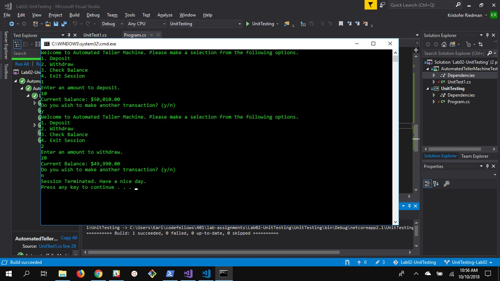

# Lab02-UnitTesting

## Summary
This app is a virtual ATM that lets users check their balance, deposit money into their bank account, and withdraw cash from their bank account.

## Step By Step
1. Start Visual Studio
2. Open solution
3. Start program without debugging
4. Select an option (1 through 4)
5. Follow the on screen instructions
